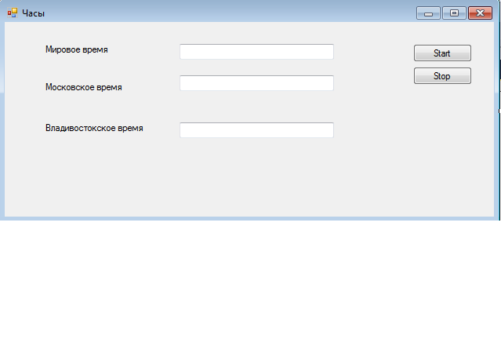

# Мировые часы

**Цель работы** Научиться работать с делегатами, словарями и таймером.

## Разработка приложения

Необходимо разработать приложение, отображающее время в трех часовых поясах:

- мировое время
- московское время
- владивостокское время

Время отображается в текстовых полях. 

Общий вид приложения:





## Архитектура программы

Программа, помимо класса **Form** для работы с окном, должна содержать класс **Clock**, работающий со временем.  

В конструкторе класса **Form** должны создаваться 3 экземпляра часов, каждый из который должен получить ссылку на поле вывода времени и название часового пояса:

- **World** - мировое время
- **Moscow** - московское время
- **Vlad** - владивостокское время


В классе **Clock** должен храниться словарь данных для часовых поясов:

```csharp
Dictionary<string,TimeSpan> zones;
zones["World"]=new TimeSpan(-2,0,0);
zones["Moscow"]=new TimeSpan(0,0,0);
zones["Vlad"]=new TimeSpan(7,0,0);
```

Для вычисления актуального времени, нужно вызвать `DateTime.Now` и прибавить значение сдвига, сохраненное в словаре.


## Делегаты

По сути, **делегаты**, - это указатели на функции, позволяющие сохранять ссылки в переменных, а потом вызывать функцию по значению, хранящемуся в переменной.

Делегат нужно сначала описать, а потом создать переменную:

```csharp
public delegate void Update(TextBox tb, DateTime dt);
public Update upd;
```

В данной задаче делегат используется для обновления из часов поля на форме.


## Пример программы с использованием одного экземпляра часов (без словаря)

```csharp
using System;
using System.Collections.Generic;
using System.ComponentModel;
using System.Data;
using System.Drawing;
using System.Linq;
using System.Text;
using System.Threading.Tasks;
using System.Windows.Forms;
using System.Timers;

namespace WindowsFormsApplication1
{
    public partial class Form1 : Form
    {
        private Clock clock1;
        public Form1()
        {
            InitializeComponent();
            clock1 = new Clock("Moscow", tbMoscow,updateTime);
        }
        public void updateTime(TextBox tb, DateTime dt)
        {
            this.Invoke(new MethodInvoker(() =>
            {
                tbWorld.Text = dt.ToString();
            }));
        }

        private void btnStart_Click(object sender, EventArgs e)
        {
            clock1.Start();
        }

        private void btnStop_Click(object sender, EventArgs e)
        {
            clock1.Stop();
        }
    }
    public class Clock
    {
        private string zone;
        public TextBox tb;
        public delegate void Update(TextBox tb, DateTime dt);
        public Update upd;
        System.Timers.Timer timer;

        public Clock(string zone,TextBox tb,Update upd)
        {
            this.zone=zone;
            this.tb = tb;
            this.upd = upd;
            timer = new System.Timers.Timer();
            timer.Interval = 1000;
            timer.Elapsed += OnTimedEvent;
            
        }
        public void Start()
        {
            timer.Enabled = true;
        }
        public void Stop()
        {
            timer.Enabled = false;
        }
        public void OnTimedEvent(Object source, ElapsedEventArgs e)
        {
            DateTime dt=DateTime.Now;
            this.upd(tb, dt);
        }
    }
}
```

## Задачи:

- исследовать принцип использования делегатов
- создать часы, отображающие мировое и владивостокское время в своих текстовых полях
- добавить словарь в класс **Clock**


