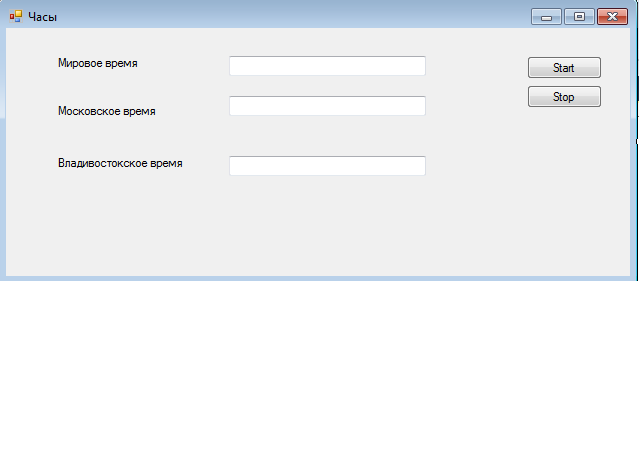

# Мировые часы

**Цель работы** Научиться работать с делегатами, словарями и таймером.

## Разработка приложения

Необходимо разработать приложение, отображающее время в трех часовых поясах:

- мировое время
- московское время
- владивостокское время


Общий вид приложения:





## Элементы программы

```
using System;
using System.Collections.Generic;
using System.ComponentModel;
using System.Data;
using System.Drawing;
using System.Linq;
using System.Text;
using System.Threading.Tasks;
using System.Windows.Forms;
using System.Timers;

namespace WindowsFormsApplication1
{
    public partial class Form1 : Form
    {
        private Clock clock1;
        public Form1()
        {
            InitializeComponent();
            clock1 = new Clock(tbMoscow,updateTime);

        }
        public void updateTime(TextBox tb, DateTime dt)
        {
            this.Invoke(new MethodInvoker(() =>
            {
                tbWorld.Text = dt.ToString();
            }));
            
        }

        private void btnStart_Click(object sender, EventArgs e)
        {
            clock1.Start();
        }

        private void btnStop_Click(object sender, EventArgs e)
        {
            clock1.Stop();
        }
    }
    public class Clock
    {
        public TextBox tb;
        public delegate void Update(TextBox tb, DateTime dt);
        public Update upd;
        System.Timers.Timer timer;

        public Clock(TextBox tb,Update upd)
        {
            this.tb = tb;
            this.upd = upd;
            timer = new System.Timers.Timer();
            timer.Interval = 1000;
            timer.Elapsed += OnTimedEvent;
            
        }
        public void Start()
        {
            timer.Enabled = true;
        }
        public void Stop()
        {
            timer.Enabled = false;
        }
        public void OnTimedEvent(Object source, ElapsedEventArgs e)
        {
            DateTime dt=DateTime.Now;
            this.upd(tb, dt);
        }
    }
}
```

## Задачи:

- исследовать принцип использования делегатов
- создать часы, отображающие мировое и московское время в своих текстовых полях
